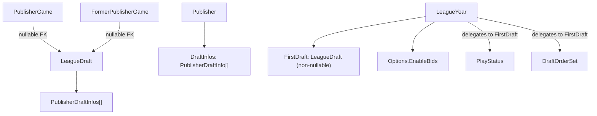

# Multi Draft Leagues

## Strategy

**Phase 1 — Single-draft compatibility (current focus)**

Wire the new data model into every layer of the app with the invariant that `FirstDraft` is the only draft that matters. The goal is a fully working app that is structurally ready for multiple drafts but behaves identically to before.

Key rule for Phase 1: everywhere the old code read `leagueYear.PlayStatus`, `leagueYear.DraftOrderSet`, `leagueYear.Options.GamesToDraft`, `publisher.DraftPosition` etc., it now reads through `leagueYear.FirstDraft` or `leagueYear.Options`. No multi-draft routing, no `CurrentDraft`, no new endpoints.

**Phase 2 — Multi-draft (future)**

After Phase 1 is confirmed working: add `CurrentDraft` logic back to `LeagueYear`, `CreateNextDraft`, `DeleteDraft`, multi-draft UI, and second-draft bid gating.

---

## Architecture Overview

---

## Status

### Step 1 — DB migration script ✓

File: `src/FantasyCritic.DatabaseUpdater/Scripts/Sequential/2026-05-21_000_multiDraftLeagues.sql`

Creates `tbl_league_draft` and `tbl_league_draftpublisher`; backfills `EnableBids = 0` for current one-shot leagues before dropping the moved columns; adds nullable `DraftID` to `tbl_league_publishergame` and `tbl_league_formerpublishergame`; drops `GamesToDraft`, `CounterPicksToDraft`, `PlayStatus`, `DraftOrderSet`, `DraftStartedTimestamp` from `tbl_league_year`; drops `DraftPosition` from `tbl_league_publisher`.

`tbl_league_draft` columns: `DraftID`, `LeagueID`, `Year`, `DraftNumber`, `Name` (varchar 255, NOT NULL — existing rows backfilled to `'InitialDraft'`), `ScheduledDate` (date, nullable — existing rows backfilled to `DATE(DraftStartedTimestamp)`, NULL when draft not yet started), `GamesToDraft`, `CounterPicksToDraft`, `DraftOrderSet` (bit, NOT NULL — backfilled from `tbl_league_year.DraftOrderSet`), `PlayStatus`, `DraftStartedTimestamp`. `Name` default dropped after backfill.

### Step 2 — Domain types ✓

**New:** `PublisherDraftInfo` (DraftID, DraftNumber, PublisherID, DraftPosition), `LeagueDraft` (DraftID, LeagueYearKey, DraftNumber, Name, ScheduledDate, GamesToDraft, CounterPicksToDraft, DraftOrderSet, PlayStatus, PublisherDraftInfos, DraftStartedTimestamp), `CreateDraftParameters` (for Phase 2).

**Updated `Publisher`:** `DraftPosition` removed; `DraftInfos: IReadOnlyList<PublisherDraftInfo>` added; `GetDraftPosition(Guid draftID)` helper.

**Updated `LeagueYear`:**
- Constructor now takes `IEnumerable<LeagueDraft> drafts`; guards that the list is non-empty.
- `FirstDraft` → `_drafts.First()` (non-nullable).
- `PlayStatus`, `DraftOrderSet`, `DraftStartedTimestamp` all delegate to `FirstDraft`.
- `OneShotMode` sums draft counts across all drafts and checks `!EnableBids`.
- `CurrentDraft` removed for Phase 1.

**Updated `LeagueOptions`:** `GamesToDraft`, `CounterPicksToDraft`, `OneShotMode` removed; `EnableBids` added. Draft-count validation moved to `LeagueDraft.ValidateDraftCounts`.

**Updated `LeagueYearParameters`:** `EnableBids` added; `GamesToDraft` and `CounterPicksToDraft` kept for Draft 1 configuration at create/edit time.

---

## Step 3 — Fix compile errors in FantasyCritic.Lib (next)

With only FantasyCritic.Lib loaded in Visual Studio, all errors are inside this project. Fix each one using the `FirstDraft` / `leagueYear.FirstDraft.GamesToDraft` pattern rather than `leagueYear.Options.GamesToDraft`. Key files:

**`src/FantasyCritic.Lib/SharedSerialization/Database/LeagueYearEntity.cs`**
- Remove `GamesToDraft`, `CounterPicksToDraft`, `PlayStatus`, `DraftOrderSet`, `DraftStartedTimestamp` fields and constructor assignments
- Add `EnableBids`
- `ToDomain()` cannot build `LeagueYear` alone — it needs a `LeagueDraft` list passed in from the repo. Signature becomes `ToDomain(..., IEnumerable<LeagueDraft> drafts)`.

**`src/FantasyCritic.Lib/Domain/Draft/DraftFunctions.cs`**
- `Options.GamesToDraft` → `leagueYear.FirstDraft.GamesToDraft`
- `Options.CounterPicksToDraft` → `leagueYear.FirstDraft.CounterPicksToDraft`
- `publisher.DraftPosition` → `publisher.GetDraftPosition(leagueYear.FirstDraft.DraftID) ?? 0` (or look up from `leagueYear.FirstDraft.PublisherDraftInfos`)

**`src/FantasyCritic.Lib/Services/DraftService.cs`**
- `leagueYear.Options.GamesToDraft` → `leagueYear.FirstDraft.GamesToDraft`
- `leagueYear.Options.CounterPicksToDraft` → `leagueYear.FirstDraft.CounterPicksToDraft`

**`src/FantasyCritic.Lib/Services/FantasyCriticService.cs`**
- Draft-count guard logic: compare `parameters.GamesToDraft` against `leagueYear.FirstDraft.GamesToDraft`
- `new LeagueYear(...)` call: pass a draft list (build from `LeagueDraft` derived from the parameters for the create-year case)
- `publisher.DraftPosition` sort → use `publisher.GetDraftPosition(...)` or sort by `DraftInfos`

**`src/FantasyCritic.Lib/Services/PublisherService.cs`**
- `existingPublishers.Max(x => x.DraftPosition)` → remove (draft position no longer lives on publisher at creation time; publishers are created without a draft position, which is set separately via SetDraftOrder)
- `new Publisher(...)` constructor: pass empty `DraftInfos` list; draft order assigned later

**`src/FantasyCritic.Lib/Domain/PublisherStateSet.cs`**
- `new LeagueYear(...)` call: pass existing `leagueYear.Drafts`
- `publisher.DraftPosition` → `publisher.GetDraftPosition(...)`

**`src/FantasyCritic.Lib/BusinessLogicFunctions/ActionProcessor.cs`**
- `publisher.DraftPosition` tiebreaker → use `publisher.GetDraftPosition(leagueYear.FirstDraft.DraftID) ?? 0`

**`src/FantasyCritic.Lib/Discord/Commands/LeagueOptionsCommand.cs`**
- `leagueYearOptions.GamesToDraft` → `leagueYear.FirstDraft.GamesToDraft`
- `leagueYearOptions.StandardGames - leagueYearOptions.GamesToDraft` → same, from `FirstDraft`

---

## Step 4 — Stored procedures

Idempotent `DROP … CREATE` files in `Scripts/Idempotent/Stored Procedures/`:

**`sp_getleagueyear.sql`**
- Add result set: `SELECT * FROM tbl_league_draft WHERE LeagueID = P_LeagueID AND Year = P_Year`
- Add result set: `SELECT dp.* FROM tbl_league_draftpublisher dp JOIN tbl_league_draft d ON dp.DraftID = d.DraftID WHERE d.LeagueID = P_LeagueID AND d.Year = P_Year`
- Fix the mid-procedure result set that selects `ly.PlayStatus` from `tbl_league_year` — join `tbl_league_draft` and pick the `DraftNumber = 1` row
- Main `SELECT * FROM tbl_league_year` now returns `EnableBids`; migrated columns are gone

**`sp_getconferenceyeardata.sql`**
- `CASE WHEN ly.PlayStatus <> 'NotStartedDraft'` → LEFT JOIN `tbl_league_draft` and aggregate per year

**`sp_getleaguesforuser.sql`**
- Inline one-shot detection: JOIN `tbl_league_draft` and SUM `GamesToDraft`/`CounterPicksToDraft` per year; use `tbl_league_year.EnableBids` for the bids condition

---

## Step 5 — MySQL implementation

**`MySQLFantasyCriticRepo.cs`**
- New entity classes: `LeagueDraftEntity`, `LeagueDraftPublisherEntity`
- In `GetLeagueYear` / `QueryMultiple`: read two new result sets; build `LeagueDraft` list with `PublisherDraftInfos`; build each `Publisher` with `DraftInfos` aggregated by `PublisherID`
- `SetDraftOrder`: write to `tbl_league_draftpublisher` (DELETE + INSERT) instead of `UPDATE tbl_league_publisher SET DraftPosition`
- Draft lifecycle (`StartDraft`, `CompleteDraft`, `SetDraftPause`, `ResetDraft`): `UPDATE tbl_league_draft SET PlayStatus = … WHERE DraftID = @draftID` (using `leagueYear.FirstDraft.DraftID`)
- `PublisherGameEntity` and `FormerPublisherGameEntity`: add nullable `DraftID`
- `LeagueYearEntity.ToDomain(...)`: updated signature accepts draft list from the repo

---

## Step 6 — Fix compile errors in all other projects

Fix `FantasyCritic.Web`, `FantasyCritic.MySQL`, `FantasyCritic.DiscordBot`, `FantasyCritic.FakeRepo`, `FantasyCritic.Test` etc. Same pattern: everywhere the old API surface is used, wire through `FirstDraft`. No new endpoints or UI yet.

---

## Step 7 — Phase 1 validation

Full build passes. App runs. All existing draft, bid, and league functionality works as before. Confirm:
- Draft can be started, picks made, draft completed
- One-shot mode is correctly detected
- Bids work for normal leagues, are blocked for one-shot
- League settings (EnableBids) round-trips correctly

---

## Phase 2 — Multi-draft (future, not started)

After Phase 1 is confirmed:
- Add `CurrentDraft` back to `LeagueYear` with full active/paused/final/pending logic
- `IFantasyCriticRepo`: add `CreateDraft`, `DeleteDraft`
- `DraftService.CreateNextDraft` (validates, optionally expands `StandardGames`, inserts new row)
- `DraftService.DeleteDraft` (only for `NotStartedDraft` + `DraftNumber > 1`)
- `POST /api/leaguemanager/createNextDraft`, `DELETE /api/leaguemanager/deleteDraft`
- UI: Create Draft button, inline StandardGames expansion, Delete Draft with confirmation
- Bid gating: block bids when `!EnableBids`

---

## Key Constraints / Risks

- **Migration statement order**: `EnableBids = 0` backfill must run before `DROP COLUMN GamesToDraft`/`CounterPicksToDraft`
- **`sp_getleagueyear` result-set order** must match C# `QueryMultiple` reads — two new result sets must be added in a coordinated SP + repo change
- **`LeagueYearEntity.ToDomain()`** cannot construct `LeagueYear` alone anymore; the repo must read drafts first and pass them in
- **`tbl_caching_leagueyear`** is already dropped — no cache table to maintain
- **`GetPublisherSlots`** on `Publisher.cs` does not use `GamesToDraft` and is unaffected
