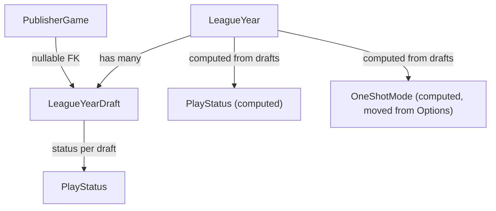

# Multi Draft Leagues

## Architecture Overview



## 1. Database Schema — new migration script

File: `src/FantasyCritic.DatabaseUpdater/Scripts/Sequential/2026-05-13_001_multiDraftLeagues.sql`

**New table `tbl_league_yeardraft`:**

- `DraftID` char(36) PK
- `LeagueID` char(36) FK → `tbl_league`
- `Year` year
- `DraftNumber` tinyint (1-based, UNIQUE per LeagueID+Year)
- `GamesToDraft` int
- `CounterPicksToDraft` int
- `PlayStatus` varchar(50)
- `DraftStartedTimestamp` timestamp NULL

**New table `tbl_league_yeardraftpublisher`** (draft order per publisher per draft):

- `DraftID` char(36) FK → `tbl_league_yeardraft`
- `PublisherID` char(36) FK → `tbl_league_publisher`
- `DraftPosition` tinyint
- PRIMARY KEY (`DraftID`, `PublisherID`)

**Migrate existing data:**
- `INSERT INTO tbl_league_yeardraft … SELECT LeagueID, Year, 1, GamesToDraft, CounterPicksToDraft, PlayStatus, DraftStartedTimestamp FROM tbl_league_year`
- `INSERT INTO tbl_league_yeardraftpublisher … SELECT <new DraftID>, PublisherID, DraftPosition FROM tbl_league_publisher WHERE DraftPosition IS NOT NULL` (join via LeagueID+Year to find the matching DraftID=1 row)
- `UPDATE tbl_league_publishergame SET DraftID = <DraftID for that year> WHERE DraftPosition IS NOT NULL` (link drafted games to their Draft 1 row)

**Alter `tbl_league_year`:**
- DROP `GamesToDraft`, `CounterPicksToDraft`, `PlayStatus`, `DraftOrderSet`, `DraftStartedTimestamp`
- ADD `AllowPickupsBetweenDrafts` bit(1) NOT NULL DEFAULT 1

**Alter `tbl_league_publisher`:**
- DROP `DraftPosition` (now lives in `tbl_league_yeardraftpublisher`)

**Alter `tbl_league_publishergame`:**
- ADD `DraftID` char(36) NULL FK → `tbl_league_yeardraft`

## 2. New Domain Types

**`LeagueYearDraft`** — `src/FantasyCritic.Lib/Domain/LeagueYearDraft.cs`

```csharp
public class LeagueYearDraft
{
    public Guid DraftID { get; }
    public LeagueYearKey LeagueYearKey { get; }
    public int DraftNumber { get; }
    public int GamesToDraft { get; }
    public int CounterPicksToDraft { get; }
    public PlayStatus PlayStatus { get; }
    public IReadOnlyList<LeagueYearDraftPublisher> DraftPublishers { get; }
    public Instant? DraftStartedTimestamp { get; }
    // Computed
    public bool DraftOrderSet => DraftPublishers.Any();
}
```

**`LeagueYearDraftPublisher`** — `src/FantasyCritic.Lib/Domain/LeagueYearDraftPublisher.cs`

```csharp
public class LeagueYearDraftPublisher
{
    public Guid DraftID { get; }
    public Guid PublisherID { get; }
    public int DraftPosition { get; }
}
```

`Publisher.DraftPosition` is removed; draft position for the current draft is resolved by joining `leagueYear.CurrentDraft.DraftPublishers` on `PublisherID`.

## 3. Changes to `LeagueOptions` — [`src/FantasyCritic.Lib/Domain/LeagueOptions.cs`](src/FantasyCritic.Lib/Domain/LeagueOptions.cs)

- **Remove** `GamesToDraft`, `CounterPicksToDraft` properties and constructor parameters
- **Add** `AllowPickupsBetweenDrafts` bool property
- **Remove** `OneShotMode` (moves to `LeagueYear` — see below)
- Update `Validate()` to remove GamesToDraft/CounterPicksToDraft checks (those move to per-draft validation)

## 4. Changes to `LeagueYear` — [`src/FantasyCritic.Lib/Domain/LeagueYear.cs`](src/FantasyCritic.Lib/Domain/LeagueYear.cs)

- **Remove** constructor params: `playStatus`, `draftOrderSet`, `draftStartedTimestamp`
- **Add** constructor param: `IEnumerable<LeagueYearDraft> drafts`
- **Add** computed properties:
  - `IReadOnlyList<LeagueYearDraft> Drafts`
  - `LeagueYearDraft? CurrentDraft` → the draft that is active/paused, or if none active, the highest-numbered DraftFinal draft, or the highest-numbered NotStartedDraft draft
  - `PlayStatus PlayStatus` → `CurrentDraft?.PlayStatus ?? PlayStatus.NotStartedDraft`
  - `bool DraftOrderSet` → `CurrentDraft?.DraftOrderSet ?? false`
  - `Instant? DraftStartedTimestamp` → `CurrentDraft?.DraftStartedTimestamp`
  - `bool OneShotMode` → `!Options.AllowPickupsBetweenDrafts && Options.StandardGames == Drafts.Sum(d => d.GamesToDraft) && Options.CounterPicks == Drafts.Sum(d => d.CounterPicksToDraft) && <existing drop/trade conditions on Options>`

## 5. Changes to `LeagueYearParameters` — [`src/FantasyCritic.Lib/Domain/Requests/LeagueYearParameters.cs`](src/FantasyCritic.Lib/Domain/Requests/LeagueYearParameters.cs)

- Keep `GamesToDraft` and `CounterPicksToDraft` — they represent Draft 1 configuration when creating/editing a year before Draft 1 starts
- Add `AllowPickupsBetweenDrafts` bool

## 6. New `CreateDraftParameters` Request Type

New file: `src/FantasyCritic.Lib/Domain/Requests/CreateDraftParameters.cs`

Used by the manager to add a subsequent draft to a league year:

- `LeagueYearKey`
- `int GamesToDraft`
- `int CounterPicksToDraft`

## 7. Repo Interface — [`src/FantasyCritic.Lib/Interfaces/IFantasyCriticRepo.cs`](src/FantasyCritic.Lib/Interfaces/IFantasyCriticRepo.cs)

New/changed signatures:

- `Task<IReadOnlyList<LeagueYearDraft>> GetDraftsForLeagueYear(LeagueYearKey key)`
- `Task CreateDraft(LeagueYearDraft draft)` — adds a new draft row (for subsequent drafts)
- `Task StartDraft(LeagueYear leagueYear)` — now updates `tbl_league_yeardraft` not `tbl_league_year`
- `Task CompleteDraft(LeagueYear leagueYear)` — same
- `Task SetDraftPause(LeagueYear leagueYear, bool pause)` — same
- `Task ResetDraft(LeagueYear leagueYear)` — now targets current draft row; if DraftNumber > 1, optionally deletes it
- `Task EditLeagueYear(LeagueYear leagueYear)` — updates `tbl_league_year`; also updates Draft 1 row if draft hasn't started

## 8. Stored Procedures — `Scripts/Idempotent/Stored Procedures/`

These are idempotent `DROP … CREATE` files, updated directly (no sequential script needed):

**`sp_getleagueyear.sql`** — primary loader, needs two new result sets added:
- Add `SELECT * FROM tbl_league_yeardraft WHERE LeagueID = P_LeagueID AND Year = P_Year`
- Add `SELECT dp.* FROM tbl_league_yeardraftpublisher dp JOIN tbl_league_yeardraft d ON dp.DraftID = d.DraftID WHERE d.LeagueID = P_LeagueID AND d.Year = P_Year`
- Fix the mid-procedure result set that selects `ly.PlayStatus` — join `tbl_league_yeardraft` instead
- The `SELECT * FROM tbl_league_year` result set now omits the migrated columns (fine, they're gone)

**`sp_getconferenceyeardata.sql`** — fix the `CASE WHEN ly.PlayStatus <> 'NotStartedDraft'` expression:
- LEFT JOIN `tbl_league_yeardraft` and check draft status there instead of `tbl_league_year.PlayStatus`

## 9. MySQL Implementation — `src/FantasyCritic.MySQL/MySQLFantasyCriticRepo.cs`

- All `UPDATE tbl_league_year SET PlayStatus = …` → `UPDATE tbl_league_yeardraft SET PlayStatus = … WHERE DraftID = @draftID`
- New entity classes: `LeagueYearDraftEntity`, `LeagueYearDraftPublisherEntity`
- `SetDraftOrder`: writes to `tbl_league_yeardraftpublisher` (DELETE existing for this DraftID, INSERT new rows) instead of updating `DraftPosition` on `tbl_league_publisher`
- `Publisher` construction: remove `DraftPosition` from publisher entity; resolve it from `LeagueYearDraftPublisher` when needed
- Update `LeagueYear` construction throughout to pass `drafts` list (each with their `DraftPublishers`)
- Update `PublisherGameEntity` to include nullable `DraftID` field

## 10. Service Changes

**`DraftService`** — [`src/FantasyCritic.Lib/Services/DraftService.cs`](src/FantasyCritic.Lib/Services/DraftService.cs)

- `StartDraft`: uses `leagueYear.CurrentDraft` for all checks
- `CompleteDraft`: count check uses `leagueYear.CurrentDraft.GamesToDraft * publisherCount`
- `DraftGame`: links new `PublisherGame.DraftID = currentDraft.DraftID`
- New method `CreateNextDraft(LeagueYear, CreateDraftParameters)` — validates year is not finished, a draft is not active, creates new `LeagueYearDraft` row with `DraftNumber = maxExisting + 1`

**`FantasyCriticService.EditLeague`** — [`src/FantasyCritic.Lib/Services/FantasyCriticService.cs`](src/FantasyCritic.Lib/Services/FantasyCriticService.cs)

- `GamesToDraft`/`CounterPicksToDraft` guard logic now targets Draft 1: blocked if Draft 1's `PlayStatus.DraftFinished`; adjustable if Draft 1 not yet started
- New `AllowPickupsBetweenDrafts` parameter flows through
- `OneShotMode` references shift from `Options.OneShotMode` → `leagueYear.OneShotMode`

**`GameAcquisitionService`** — bid/pickup guard changes:

- `OneShotMode` check: `leagueYear.OneShotMode` (was `leagueYear.Options.OneShotMode`)
- New check: if `!Options.AllowPickupsBetweenDrafts` AND a subsequent draft is pending (created but `NotStartedDraft`), block bids

## 11. Web Layer

**Controllers** — `LeagueManagerController.cs`, `LeagueController.cs`

- `OneShotMode` references: `leagueYear.OneShotMode` throughout
- New endpoint: `POST /api/leaguemanager/createNextDraft` → calls `DraftService.CreateNextDraft`
- Existing draft endpoints (`StartDraft`, `ResetDraft`, `SetDraftOrder`, etc.) remain largely the same; they operate on `leagueYear.CurrentDraft`

**ViewModels**

- `PlayStatusViewModel` — no structural change; fed by computed `leagueYear.PlayStatus`
- Update `LeagueYearSettingsViewModel` / response models to include `AllowPickupsBetweenDrafts` and a list of draft summaries
- New `LeagueYearDraftViewModel` with `DraftID`, `DraftNumber`, `GamesToDraft`, `CounterPicksToDraft`, `PlayStatus`

**`RequiredYearStatus`** — no structural change; still reads `leagueYear.PlayStatus` (now computed)

## 12. Frontend — `src/FantasyCritic.Web/ClientApp/`

- `leagueYearSettings.vue` — add `AllowPickupsBetweenDrafts` toggle; `GamesToDraft` field only editable when Draft 1 hasn't started
- League manager page — new "Create Draft #N" button (visible after Draft 1 is final and year not finished)
- Draft status displays — show which draft number is currently active (e.g. "Draft 2 in progress")
- `leagueMixin.js` — `oneShotMode` reads from `leagueYear.oneShotMode` (unchanged if API still returns the field)

## Key Constraints / Risks

- `GamesToDraft` is referenced in ~15+ places across Lib, MySQL, Web, and Discord — the removal from `LeagueOptions` is the biggest ripple change
- `OneShotMode` moving from `LeagueOptions` to `LeagueYear` touches every controller/service that calls `Options.OneShotMode`
- `Publisher.DraftPosition` removal ripples into `DraftFunctions.GetNextDraftPublisher` and `GetDraftPositions` — these must be updated to resolve position from `CurrentDraft.DraftPublishers`
- The DB migration must atomically copy draft data and drop old columns — needs careful testing against existing year data
- `sp_getleagueyear` returns multiple result sets in a fixed order; the C# repo reads them positionally via Dapper's `QueryMultiple` — adding two new result sets requires matching C# read order updates
- `GetPublisherSlots` logic on `Publisher.cs` does not use `GamesToDraft` and is unaffected
