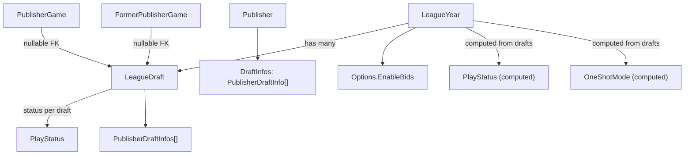

# Multi Draft Leagues

## Architecture Overview



## Note: Throughout the entire plan, only complete one step at a time, then check back in with the user.

## 1. Database Schema — new migration script

File: `src/FantasyCritic.DatabaseUpdater/Scripts/Sequential/YYYY-MM-DD_NNN_multiDraftLeagues.sql`

**New table `tbl_league_draft`:**

- `DraftID` char(36) PK
- `LeagueID` char(36) FK → `tbl_league`
- `Year` year
- `DraftNumber` tinyint (1-based, UNIQUE per LeagueID+Year)
- `GamesToDraft` int
- `CounterPicksToDraft` int
- `PlayStatus` varchar(50)
- `DraftStartedTimestamp` timestamp NULL

**New table `tbl_league_draftpublisher`** (draft order per publisher per draft):

- `DraftID` char(36) FK → `tbl_league_draft`
- `PublisherID` char(36) FK → `tbl_league_publisher`
- `DraftPosition` tinyint
- PRIMARY KEY (`DraftID`, `PublisherID`)

**Migrate existing data:**

- `INSERT INTO tbl_league_draft … SELECT LeagueID, Year, 1, GamesToDraft, CounterPicksToDraft, PlayStatus, DraftStartedTimestamp FROM tbl_league_year`
- `INSERT INTO tbl_league_draftpublisher … SELECT <new DraftID>, PublisherID, DraftPosition FROM tbl_league_publisher WHERE DraftPosition IS NOT NULL` (join via LeagueID+Year to resolve the matching DraftID)
- `UPDATE tbl_league_publishergame SET DraftID = <DraftID for that year> WHERE DraftPosition IS NOT NULL`
- `UPDATE tbl_league_formerpublishergame SET DraftID = <DraftID for that year> WHERE DraftPosition IS NOT NULL`

**Alter `tbl_league_year`:**

- DROP `GamesToDraft`, `CounterPicksToDraft`, `PlayStatus`, `DraftOrderSet`, `DraftStartedTimestamp`
- ADD `**EnableBids` bit(1) NOT NULL DEFAULT 1
- Backfill: `UPDATE tbl_league_year SET EnableBids = 0 WHERE StandardGames = GamesToDraft AND CounterPicks = CounterPicksToDraft AND UnrestrictedReleaseStatusDroppableGames = 0 AND WillNotReleaseDroppableGames = 0 AND WillReleaseDroppableGames = 0 AND GrantSuperDrops = 0 AND TradingSystem = 'NoTrades'` — **this UPDATE must run before the DROP of GamesToDraft/CounterPicksToDraft**, so order the statements accordingly

**Alter `tbl_league_publisher`:**

- DROP `DraftPosition` (now lives in `tbl_league_draftpublisher`)

**Alter `tbl_league_publishergame`:**

- ADD `DraftID` char(36) NULL FK → `tbl_league_draft`

**Alter `tbl_league_formerpublishergame`:**

- ADD `DraftID` char(36) NULL FK → `tbl_league_draft`

## 2. Domain Types

`**PublisherDraftInfo` — `src/FantasyCritic.Lib/Domain/PublisherDraftInfo.cs`

```csharp
public class PublisherDraftInfo
{
    public Guid DraftID { get; }
    public Guid PublisherID { get; }
    public int DraftPosition { get; }
}
```

`**LeagueDraft**` — `src/FantasyCritic.Lib/Domain/LeagueDraft.cs`

```csharp
public class LeagueDraft
{
    public Guid DraftID { get; }
    public LeagueYearKey LeagueYearKey { get; }
    public int DraftNumber { get; }
    public int GamesToDraft { get; }
    public int CounterPicksToDraft { get; }
    public PlayStatus PlayStatus { get; }
    public IReadOnlyList<PublisherDraftInfo> PublisherDraftInfos { get; }
    public Instant? DraftStartedTimestamp { get; }
    public bool DraftOrderSet => PublisherDraftInfos.Any();
}
```

`**[Publisher.cs](src/FantasyCritic.Lib/Domain/Publisher.cs)**`

- Remove scalar `**DraftPosition**` from constructor and properties.
- Add `**IReadOnlyList<PublisherDraftInfo> DraftInfos**` (one entry per draft this publisher participates in for the year).
- Helper: `int? GetDraftPosition(Guid draftID)` via lookup in `DraftInfos`.

Draft order can be resolved from either side: `leagueYear.CurrentDraft.PublisherDraftInfos` or `publisher.GetDraftPosition(currentDraft.DraftID)`.

## 3. Changes to `LeagueOptions` — `[src/FantasyCritic.Lib/Domain/LeagueOptions.cs](src/FantasyCritic.Lib/Domain/LeagueOptions.cs)`

- **Remove** `GamesToDraft`, `CounterPicksToDraft` properties and constructor parameters
- **Add** `**EnableBids` bool property (general bids-on/off; not tied to multi-draft naming)
- **Remove** `OneShotMode` (moves to `LeagueYear` — see below)
- Update `Validate()` to remove `GamesToDraft`/`CounterPicksToDraft` checks (those move to per-draft validation)

## 4. Changes to `LeagueYear` — `[src/FantasyCritic.Lib/Domain/LeagueYear.cs](src/FantasyCritic.Lib/Domain/LeagueYear.cs)`

- **Remove** constructor params: `playStatus`, `draftOrderSet`, `draftStartedTimestamp`
- **Add** constructor param: `IEnumerable<LeagueDraft> drafts`
- **Add** computed properties:
  - `IReadOnlyList<LeagueDraft> Drafts`
  - `LeagueDraft? CurrentDraft` → the draft that is active/paused; if none, the highest-numbered `DraftFinal`; if none, the highest-numbered `NotStartedDraft`
  - `PlayStatus PlayStatus` → `CurrentDraft?.PlayStatus ?? PlayStatus.NotStartedDraft`
  - `bool DraftOrderSet` → `CurrentDraft?.DraftOrderSet ?? false`
  - `Instant? DraftStartedTimestamp` → `CurrentDraft?.DraftStartedTimestamp`
  - `bool OneShotMode` → `!Options.EnableBids && Options.StandardGames == Drafts.Sum(d => d.GamesToDraft) && Options.CounterPicks == Drafts.Sum(d => d.CounterPicksToDraft) && <existing drop/trade conditions on Options>`

## 5. Changes to `LeagueYearParameters` — `[src/FantasyCritic.Lib/Domain/Requests/LeagueYearParameters.cs](src/FantasyCritic.Lib/Domain/Requests/LeagueYearParameters.cs)`

- Keep `GamesToDraft` and `CounterPicksToDraft` — they represent Draft 1 configuration when creating/editing a year before Draft 1 starts
- Add `**EnableBids` bool

## 6. New `CreateDraftParameters` Request Type

New file: `src/FantasyCritic.Lib/Domain/Requests/CreateDraftParameters.cs`

```csharp
public class CreateDraftParameters
{
    public LeagueYearKey LeagueYearKey { get; }
    public int GamesToDraft { get; }
    public int CounterPicksToDraft { get; }
    public int? NewStandardGames { get; } // optional: expand slots atomically
}
```

Validation in `DraftService.CreateNextDraft`:

- Year must not be finished; no draft currently active
- If `NewStandardGames` provided, must be ≥ current `StandardGames`
- Total `GamesToDraft` across all existing drafts + new draft must not exceed the resulting `StandardGames`
- If `NewStandardGames` provided, `tbl_league_year.StandardGames` is updated in the same transaction

## 7. Repo Interface — `[src/FantasyCritic.Lib/Interfaces/IFantasyCriticRepo.cs](src/FantasyCritic.Lib/Interfaces/IFantasyCriticRepo.cs)`

Drafts are **not** fetched via a separate public method — they load as part of `GetLeagueYear` and live on `LeagueYear.Drafts`.

**Public changes:**

- **Do not add** `GetDraftsForLeagueYear`
- `Task CreateDraft(LeagueDraft draft)` — inserts a new draft row
- `Task DeleteDraft(LeagueDraft draft)` — valid only when `PlayStatus = NotStartedDraft` AND `DraftNumber > 1`; enforced at service layer before calling
- `Task StartDraft(LeagueYear leagueYear)` — updates `tbl_league_draft` via `leagueYear.CurrentDraft`
- `Task CompleteDraft(LeagueYear leagueYear)` — same
- `Task SetDraftPause(LeagueYear leagueYear, bool pause)` — same
- `Task ResetDraft(LeagueYear leagueYear)` — resets current draft's `PlayStatus` to `NotStartedDraft`; clears `tbl_league_draftpublisher` rows for that `DraftID` (order must be re-set)
- `Task EditLeagueYear(LeagueYear leagueYear)` — updates `tbl_league_year` (including `EnableBids`); updates Draft 1 row when Draft 1 not yet started

Private mapping helpers inside `MySQLFantasyCriticRepo` are fine for assembling drafts from SP result sets.

## 8. Stored Procedures — `Scripts/Idempotent/Stored Procedures/`

These are idempotent `DROP … CREATE` files, updated directly (no sequential script needed):

`**sp_getleagueyear.sql` — add two new result sets:

- `SELECT * FROM tbl_league_draft WHERE LeagueID = P_LeagueID AND Year = P_Year`
- `SELECT dp.* FROM tbl_league_draftpublisher dp JOIN tbl_league_draft d ON dp.DraftID = d.DraftID WHERE d.LeagueID = P_LeagueID AND d.Year = P_Year`
- Fix mid-procedure result set that selects `ly.PlayStatus` — join `tbl_league_draft` instead
- Main `SELECT * FROM tbl_league_year` result set now includes `EnableBids`; migrated columns are gone

`**sp_getconferenceyeardata.sql` — `CASE WHEN ly.PlayStatus <> 'NotStartedDraft'` expression:

- LEFT JOIN `tbl_league_draft` and check draft status there instead of `tbl_league_year.PlayStatus`

`**sp_getleaguesforuser.sql` — inline one-shot detection currently reads `GamesToDraft`/`CounterPicksToDraft` from `tbl_league_year`:

- JOIN `tbl_league_draft` and SUM draft counts per year for `GamesToDraft`/`CounterPicksToDraft`; use `tbl_league_year.EnableBids` for the bids condition; other predicates (`StandardGames`, droppables, `TradingSystem`) remain on `tbl_league_year`

## 9. MySQL Implementation — `src/FantasyCritic.MySQL/MySQLFantasyCriticRepo.cs`

- All `UPDATE tbl_league_year SET PlayStatus = …` → `UPDATE tbl_league_draft SET PlayStatus = … WHERE DraftID = @draftID`
- New entity classes: `LeagueDraftEntity`, `LeagueDraftPublisherEntity` (DB mapping only; domain uses `PublisherDraftInfo`)
- In `GetLeagueYear` / `QueryMultiple`: read two new result sets (draft rows + draft-publisher rows); build `LeagueDraft` list with `PublisherDraftInfos`; build each `Publisher` with `DraftInfos` aggregated across drafts by `PublisherID`
- `SetDraftOrder`: writes to `tbl_league_draftpublisher` (DELETE existing for this `DraftID`, INSERT new rows) instead of updating `DraftPosition` on `tbl_league_publisher`
- Update `PublisherGameEntity` and `FormerPublisherGameEntity` to include nullable `DraftID` field

`**[LeagueYearEntity](src/FantasyCritic.Lib/SharedSerialization/Database/LeagueYearEntity.cs)` — remove migrated columns; add `EnableBids`; `ToDomain()` accepts drafts from repo mapping (not from this entity alone).

## 10. Service Changes

`**DraftService` — `[src/FantasyCritic.Lib/Services/DraftService.cs](src/FantasyCritic.Lib/Services/DraftService.cs)`

- `StartDraft`: uses `leagueYear.CurrentDraft`
- `CompleteDraft`: count check uses `leagueYear.CurrentDraft.GamesToDraft * publisherCount`
- `DraftGame`: sets `PublisherGame.DraftID = currentDraft.DraftID`
- `CreateNextDraft(LeagueYear, CreateDraftParameters)`: validates, optionally updates `StandardGames`, inserts new `LeagueDraft` row with `DraftNumber = maxExisting + 1`
- `DeleteDraft(LeagueYear, LeagueDraft)`: validates `PlayStatus = NotStartedDraft` AND `DraftNumber > 1`; calls repo `DeleteDraft`

`**DraftFunctions`: resolve pick order from `CurrentDraft.PublisherDraftInfos` or `publisher.GetDraftPosition(currentDraft.DraftID)` — not `publisher.DraftPosition`.

`**FantasyCriticService.EditLeague` — `[src/FantasyCritic.Lib/Services/FantasyCriticService.cs](src/FantasyCritic.Lib/Services/FantasyCriticService.cs)`

- `GamesToDraft`/`CounterPicksToDraft` guard targets Draft 1: blocked if Draft 1 is `DraftFinal`; adjustable if not yet started
- `EnableBids` flows through `LeagueOptions` / `LeagueYearParameters`
- `OneShotMode` references shift from `Options.OneShotMode` → `leagueYear.OneShotMode`

`**GameAcquisitionService`\*\*:

- Reject bids when `!leagueYear.Options.EnableBids`
- `OneShotMode` check: `leagueYear.OneShotMode` (was `leagueYear.Options.OneShotMode`)

## 11. Web Layer

**Controllers** — `LeagueManagerController.cs`, `LeagueController.cs`

- `OneShotMode` references: `leagueYear.OneShotMode` throughout
- `POST /api/leaguemanager/createNextDraft` → `DraftService.CreateNextDraft` (body includes `GamesToDraft`, `CounterPicksToDraft`, optional `NewStandardGames`)
- `DELETE /api/leaguemanager/deleteDraft` → `DraftService.DeleteDraft` (body includes `DraftID`; service enforces constraints)
- Existing draft endpoints operate on `leagueYear.CurrentDraft`

**ViewModels**

- `PlayStatusViewModel` — no structural change; fed by computed `leagueYear.PlayStatus`
- Update settings response models to include `**enableBids` and draft summary list
- New `LeagueDraftViewModel` with `DraftID`, `DraftNumber`, `GamesToDraft`, `CounterPicksToDraft`, `PlayStatus`

`**RequiredYearStatus` — no structural change; still reads `leagueYear.PlayStatus` (now computed)

## 12. Frontend — `src/FantasyCritic.Web/ClientApp/`

- `leagueYearSettings.vue` — `**EnableBids` toggle (general "allow bids"); `GamesToDraft` only editable when Draft 1 hasn't started
- League manager page — "Create Draft #N" button (visible after Draft 1 is final, year not finished); UI surfaces two paths:
  - **Pre-expanded**: `StandardGames` already covers the new draft's slots — just pick `GamesToDraft`/`CounterPicksToDraft`
  - **Inline expansion**: `StandardGames` needs to grow — show a field to set the new total alongside the draft counts
- Draft status display shows which draft number is active ("Draft 2 in progress")
- Delete Draft button on a `NotStartedDraft` subsequent draft (with confirmation)
- `leagueMixin.js` — `oneShotMode` reads from API as today

## Key Constraints / Risks

- **Migration statement order**: the `EnableBids = 0` backfill UPDATE must run before the `DROP COLUMN GamesToDraft`/`CounterPicksToDraft` ALTERs
- `GamesToDraft` is referenced in ~15+ places across Lib, MySQL, Web, and Discord — removal from `LeagueOptions` is the biggest ripple change
- `OneShotMode` moving from `LeagueOptions` to `LeagueYear` touches every controller/service that calls `Options.OneShotMode`
- `Publisher.DraftPosition` removal ripples into `DraftFunctions.GetNextDraftPublisher` and `GetDraftPositions` — use `PublisherDraftInfo` instead
- `LeagueYearEntity` in `SharedSerialization/Database/` must be updated before the stack compiles cleanly
- `sp_getleagueyear` result-set order must match C# `QueryMultiple` reads — adding two new result sets requires coordinated SP + repo changes
- `tbl_caching_leagueyear` is already dropped — no cache table to maintain for one-shot listing
- `GetPublisherSlots` on `Publisher.cs` does not use `GamesToDraft` and is unaffected
