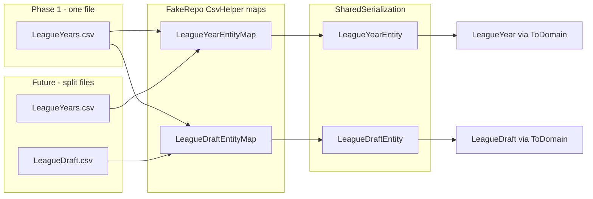

# Test project: build and CSV adapter sub-plan

Parent plan: [multi-draft-leagues.plan.md](I:/CodeProjects/FantasyCritic/.cursor/plans/multi-draft-leagues.plan.md) (Step 6 partial — Web deferred; **Test + FakeRepo** in scope here).

## Design principle (user direction)

**Write the code as if `LeagueDraft.csv` already exists.**

- Use the real shared type [`LeagueDraftEntity`](I:/CodeProjects/FantasyCritic/src/FantasyCritic.Lib/SharedSerialization/Database/LeagueDraftEntity.cs) and `LeagueDraftEntity.ToDomain(...)`, not a one-off `TestLeagueYearCsvRecord`.
- For Phase 1, still read **`LeagueYears.csv`** — but through a dedicated **`LeagueDraftEntityMap`** that maps draft columns (`GamesToDraft`, `PlayStatus`, `DraftOrderSet`, `DraftStartedTimestamp`, etc.) onto `LeagueDraftEntity` with the right **defaults** for columns that do not exist on the CSV row (`DraftID`, `DraftNumber`, `Name`, `ScheduledDate`).
- [`LeagueYearEntityMap`](I:/CodeProjects/FantasyCritic/src/FantasyCritic.FakeRepo/TestUtilities/LeagueYearEntityMap.cs) continues to read the **same file** for year/options columns only; CsvHelper ignores unmapped draft columns on `LeagueYearEntity`.
- **Later phase:** physically add `LeagueDraft.csv` under each `TestData/{scenario}/` folder and change only the draft reader’s file path — maps and `TestDataService` shape stay the same.



## Current state

- **MySQL + Lib**: build clean.
- **FantasyCritic.Test**: blocked on **3 FakeRepo compile errors** (FakeRepo → Test dependency chain).
- **52 CSV files** under [`TestData/`](I:/CodeProjects/FantasyCritic/src/FantasyCritic.Test/TestData/) — **unchanged** in Phase 1.

## Part A — Easy: get it to build

### A1. Fix the three FakeRepo compile errors

| File | Fix |
|------|-----|
| [`LeagueYearEntityMap.cs`](I:/CodeProjects/FantasyCritic/src/FantasyCritic.FakeRepo/TestUtilities/LeagueYearEntityMap.cs) | Remove `Map(m => m.DraftStartedTimestamp)`. Add `Map(m => m.EnableBids)` default or leave unset until Part B post-read derivation. |
| [`TestPublisherEntity.cs`](I:/CodeProjects/FantasyCritic/src/FantasyCritic.FakeRepo/TestUtilities/TestPublisherEntity.cs) | `PublisherDraftInfo` via deterministic `DraftID` (A2). |
| [`TestDataService.cs`](I:/CodeProjects/FantasyCritic/src/FantasyCritic.FakeRepo/TestUtilities/TestDataService.cs) | Pass `IEnumerable<LeagueDraft>` into `ToDomain` (minimal empty draft acceptable for A1 compile-only; Part B fills real drafts). |

### A2. `TestLeagueDraftIds` (stable DraftID)

Publishers load before league years in [`BaseActionProcessingTests`](I:/CodeProjects/FantasyCritic/src/FantasyCritic.Test/ActionProcessingTests/BaseActionProcessingTests.cs). **`TestLeagueDraftIds.For(LeagueYearKey)`** produces a stable `Guid` used by:

- `LeagueDraftEntityMap` → `Map(m => m.DraftID).Convert(...)` (or post-read assign)
- `TestPublisherEntity.ToDomain` → `PublisherDraftInfo(draftId, 1, publisherId, draftPosition)`

### A3. Discord hand-built fixtures

[`BaseGameNewsTests.cs`](I:/CodeProjects/FantasyCritic/src/FantasyCritic.Test/Discord/BaseGameNewsTests.cs): update `Publisher`, `LeagueOptions` (`enableBids`), and `LeagueYear` constructors to match multi-draft domain.

### A4. Build verification

```bash
dotnet build src/FantasyCritic.FakeRepo/FantasyCritic.FakeRepo.csproj
dotnet build src/FantasyCritic.Test/FantasyCritic.Test.csproj
```

---

## Part B — Hard: get tests to pass

### B1. `LeagueDraftEntityMap` (core adapter)

New file: `FantasyCritic.FakeRepo/TestUtilities/LeagueDraftEntityMap.cs`

Read **`LeagueYears.csv`** into **`LeagueDraftEntity`** (same path as today’s league year read):

| `LeagueDraftEntity` property | CSV column / default |
|-----------------------------|----------------------|
| `LeagueID`, `Year` | From CSV |
| `GamesToDraft`, `CounterPicksToDraft`, `PlayStatus`, `DraftOrderSet`, `DraftStartedTimestamp` | From CSV (column names match or explicit `Map`) |
| `DraftID` | `TestLeagueDraftIds.For(LeagueID, Year)` — not in CSV |
| `DraftNumber` | Constant `1` |
| `Name` | Constant `"InitialDraft"` |
| `ScheduledDate` | Constant `null` (Phase 1; optional later: `DATE(DraftStartedTimestamp)`) |

`TestDataService` adds something like `GetLeagueDraftEntities()` mirroring `GetLeagueYearEntities()` — **same filename today**, comment that path will become `LeagueDraft.csv` in a future split.

### B2. `LeagueYearEntity` + `EnableBids` (not on draft CSV)

`EnableBids` is on [`LeagueYearEntity`](I:/CodeProjects/FantasyCritic/src/FantasyCritic.Lib/SharedSerialization/Database/LeagueYearEntity.cs) only. After reading paired rows, set per `(LeagueID, Year)` using production one-shot inverse (same rule as migration / `sp_getleaguesforuser`):

`EnableBids = false` when `StandardGames == GamesToDraft && CounterPicks == CounterPicksToDraft &&` droppable counts are zero && `!GrantSuperDrops && TradingSystem == NoTrades`; else `true`.

Small helper acceptable (`TestLeagueYearDefaults.DeriveEnableBids(leagueYearEntity, leagueDraftEntity)`); keep logic in one place.

### B3. Rewire `TestDataService.GetLeagueYears`

1. `leagueYearEntities` ← `LeagueYears.csv` + `LeagueYearEntityMap`
2. `leagueDraftEntities` ← **`LeagueYears.csv`** + `LeagueDraftEntityMap` (future: path → `LeagueDraft.csv`)
3. Join on `(LeagueID, Year)`; apply `EnableBids` to year entity
4. For each row: `publishersInLeague` from lookup → build `PublisherDraftInfo` list for draft → `leagueDraftEntity.ToDomain(publisherDraftInfos)` → `leagueYearEntity.ToDomain(..., leagueDrafts: [draft])`
5. Fix hardcoded `MinimalLeagueYearInfo(..., PlayStatus.DraftFinal)` to use draft entity’s `PlayStatus`

No `TestLeagueYearCsvRecord`, no parallel “adapter DTO” — the pipeline **looks like production**: entity maps → `ToDomain`.

### B4. Publishers (`Publishers.csv`)

Unchanged file. [`TestPublisherEntity`](I:/CodeProjects/FantasyCritic/src/FantasyCritic.FakeRepo/TestUtilities/TestPublisherEntity.cs) keeps `DraftPosition` column; `ToDomain` uses same `TestLeagueDraftIds` as `LeagueDraftEntityMap`.

Future optional alignment: `LeagueDraftPublisherEntity` + map from `Publishers.csv` (same “pretend the file exists” pattern) — **not required** for Phase 1 if `TestPublisherEntity` works.

### B5. Tests and Verify snapshots

```bash
dotnet test src/FantasyCritic.Test/FantasyCritic.Test.csproj
```

42 action-processing `*.verified.txt` files — update only when diffs are understood (often `EnableBids` / one-shot).

### B6. Future: split CSV files (explicitly deferred)

| Step | Change |
|------|--------|
| Export / generate `LeagueDraft.csv` per scenario from current `LeagueYears` draft columns | Data migration script or one-time export |
| `GetLeagueDraftEntities()` | `Path.Combine(_basePath, "LeagueDraft.csv")` instead of `LeagueYears.csv` |
| `LeagueYears.csv` | Remove draft columns when convenient (not required for tests to pass) |

Maps and `TestDataService` join logic **unchanged** — this is why Phase 1 code is written “as if” the draft file already exists.

---

## Files touched (summary)

**New (FakeRepo):**

- `LeagueDraftEntityMap.cs`
- `TestLeagueDraftIds.cs`

**Edit (FakeRepo):**

- `TestDataService.cs` — dual read from `LeagueYears.csv`, join, `ToDomain`
- `LeagueYearEntityMap.cs`, `TestPublisherEntity.cs`

**Edit (Test):**

- `Discord/BaseGameNewsTests.cs`

**Unchanged Phase 1:**

- All `TestData/**/*.csv` contents
- `FantasyCritic.Web`

**Removed from plan (superseded):**

- `TestLeagueYearCsvRecord` / `TestLeagueDraftAdapter` as primary approach

---

## Suggested commit order

1. Part A: build fixes (FakeRepo + Discord).
2. Part B: `LeagueDraftEntityMap` + `TestDataService` rewire + `EnableBids` derivation.
3. Part B: `dotnet test` + Verify updates if needed.
